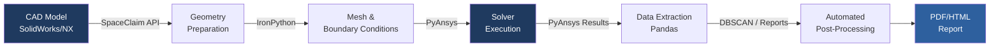

# Mohd Aaquib Khan — Simulation & Automation Portfolio

**Modeling & Simulation Specialist | 12+ Years FEA & Multi-Physics | PyAnsys | ML-Enhanced Workflows**

[](https://linkedin.com/in/mohdaaquibkhan)
[](mailto:a.khan.iitp@gmail.com)


---

## About Me

I am a structural simulation specialist with 12+ years of hands-on experience in FEA and multi-physics modelling, spanning product development at **BSH Hausgeräte GmbH (Bosch Group)** and **Dover India**. My work sits at the intersection of physics-based simulation, Python automation, and machine learning — I build the models, then automate everything around them.

What I cannot show here: proprietary simulation results from BSH and Dover (IP). What I can show: the Python tools, methodology, and academic work that represent how I actually work.

---

## Tools & Software

### Simulation Platforms

| Tool | Proficiency | Primary Use |
|------|-------------|-------------|
| **Ansys Mechanical** | ⬛⬛⬛⬛⬛ Expert | Structural, thermo-structural, fatigue, dynamics |
| **Ansys SpaceClaim** | ⬛⬛⬛⬛⬛ Expert | Geometry preparation, de-featuring, submodelling |
| **Ansys Optislang** | ⬛⬛⬛⬛⬜ Advanced | DOE, RSO, surrogate models (ROMs) |
| **Ansys DesignXplorer** | ⬛⬛⬛⬛⬜ Advanced | Parametric studies, topology optimisation |
| **nCode DesignLife** | ⬛⬛⬛⬜⬜ Proficient | HCF/LCF fatigue, durability assessment |
| **LS-DYNA** | ⬛⬛⬛⬜⬜ Proficient | Explicit dynamics (HPC coordination) |
| **Ansys SimAI / Altair PhysicsAI** | ⬛⬛⬜⬜⬜ Evaluation | AI-enhanced FEA inference pipelines |
| **SolidWorks** | ⬛⬛⬛⬛⬜ Advanced | CAD (CSWP Certified) |
| **Siemens NX** | ⬛⬛⬛⬜⬜ Intermediate | CAD modelling |

### Programming & Data

| Tool | Proficiency | Primary Use |
|------|-------------|-------------|
| **Python** | ⬛⬛⬛⬛⬜ Advanced | PyAnsys, IronPython, automation, ML pipelines |
| **MATLAB** | ⬛⬛⬛⬛⬜ Advanced | GUI apps, material models, numerical methods |
| **Scikit-learn** | ⬛⬛⬛⬜⬜ Proficient | DBSCAN clustering, ML classification |
| **PyTorch** | ⬛⬛⬛⬜⬜ Proficient | Deep learning, surrogate training |
| **Pandas / NumPy** | ⬛⬛⬛⬛⬜ Advanced | Simulation data processing |

---

## Analysis Types

```
Static & Transient Structural    ████████████  Expert
Nonlinear (contact, buckling)    ████████████  Expert
Thermo-Structural (coupled)      ███████████░  Advanced
Modal & Harmonic Vibration       ███████████░  Advanced
Fatigue (HCF / LCF)              ███████████░  Advanced
Rotordynamics                    █████████░░░  Proficient
Topology Optimisation            █████████░░░  Proficient
FSI (Fluid-Structure)            ████████░░░░  Working
Explicit Dynamics (LS-DYNA)      ████████░░░░  Working
```

---

## Automation Pipeline Architecture

This is the end-to-end simulation automation workflow I built at BSH using PyAnsys and IronPython:



**Impact:** Reduced full-simulation-cycle setup from ~4 hours (manual) to under 30 minutes (automated).

---

## Repository Contents

### [`python-automation/`](./python-automation/)

| File | Description |
|------|-------------|
| [`dbscan_fea_clustering_demo.py`](./python-automation/dbscan_fea_clustering_demo.py) | Demonstrates the DBSCAN stress-hotspot clustering methodology on synthetic FEA-style data. Runnable end-to-end. |
| [`surrogate_model_demo.py`](./python-automation/surrogate_model_demo.py) | Surrogate/ROM concept demo: train a polynomial response surface on synthetic DOE data, predict without solver. |
| [`cv_builder_utils.py`](./python-automation/cv_builder_utils.py) | Full python-docx automation library (800+ lines). Demonstrates COM automation, XML manipulation, PDF export via Word COM — a real production Python package. |

### [`mtech-thesis/`](./mtech-thesis/)
M.Tech. thesis abstract and methodology notes — thermoplastic failure characterisation via dissipated-energy method (BITS Pilani, CGPA 9.83/10, Batch Topper).

---

## Project Highlights

> **Note on confidentiality:** All BSH and Dover work involves proprietary product data. Descriptions below cover the methodology and outcomes; no simulation files, meshes, or result data are shared.

---

### 1 — End-to-End Simulation Workflow Automation (BSH Hausgeräte / Bosch Group)
**Tools:** Python, PyAnsys, IronPython, Ansys Mechanical, SpaceClaim  
**Type:** Automation / Scripting

Built a suite of Python packages that automate the complete simulation lifecycle:
- SpaceClaim scripting for geometry de-featuring, submodel cutting, and repair
- IronPython-driven Ansys Mechanical scripts for analysis tree setup, mesh controls, and parameterised boundary condition application
- Results extraction, post-processing, and automated PDF report generation

**Outcome:** Workflow setup time reduced from ~4 hours to under 30 minutes. Adopted by the global Germany–India modelling team.

---

### 2 — DBSCAN-Based FEA Post-Processing Tool (BSH Hausgeräte / Bosch Group)
**Tools:** Python, Scikit-learn (DBSCAN), Pandas, Ansys Results API  
**Type:** ML + Simulation

> See the runnable demo: [`dbscan_fea_clustering_demo.py`](./python-automation/dbscan_fea_clustering_demo.py)

Developed a production Python tool that:
1. Reads FEA nodal stress results from Ansys result databases
2. Applies DBSCAN (density-based clustering) to automatically detect spatial stress-hotspot clusters
3. Ranks clusters by peak and mean severity
4. Generates a structured engineering report with hotspot locations and metrics

**Outcome:** Replaced a 2-hour manual post-processing review with a 5-minute automated pipeline. Adopted org-wide.

---

### 3 — Surrogate Model (ROM) for Nonlinear DOE (BSH Hausgeräte / Bosch Group)
**Tools:** Ansys Optislang, Python, Ansys Mechanical  
**Type:** Surrogate Modelling / Design Optimisation

> See the methodology demo: [`surrogate_model_demo.py`](./python-automation/surrogate_model_demo.py)

Built a full DOE pipeline for a highly nonlinear snap-fit simulation:
- Parameterised geometry and material variables in Ansys Optislang
- Automated solver execution across hundreds of design points
- Trained a polynomial + RBF response-surface surrogate (ROM) on the DOE results
- Deployed ROM for instant design space exploration — eliminating repeated solver runs

**Outcome:** Design optimisation iterations reduced from hours per run to milliseconds.

---

### 4 — Thermoplastic Failure Characterisation (M.Tech Thesis — BITS Pilani)
**Tools:** MATLAB, Experimental test data  
**Type:** Computational Material Science / Numerical Methods

Developed a MATLAB application to characterise failure of thermoplastic polymers:
- Implemented viscoelastic and viscoplastic constitutive models
- Extracted material parameters from DMA and creep/recovery test data
- Applied the dissipated-energy failure criterion to predict failure initiation
- Validated model predictions against independent experimental datasets

**Outcome:** CGPA 9.83 / 10 (Batch Topper). Thesis delivered a reusable MATLAB tool applicable to thermoplastic material qualification.

---

### 5 — Structural Optimisation: CO2 AdvansorFlex Refrigeration Rack (Dover)
**Tools:** Ansys Mechanical, SolidWorks  
**Type:** Structural FEA / Design Optimisation

Led FEA-driven structural redesign of a CO2 transcritical commercial refrigeration rack:
- Static and fatigue analysis under operating pressure and thermal loads
- Identified failure-critical welds and structural members
- Iterative design optimisation to reduce mass while meeting safety factors
- Presented validation to the US engineering team during onsite assignment

**Outcome:** Product won the **Accelerate America 2017 Innovation of the Year** award.

---

### 6 — AI-Enhanced Simulation Evaluation: SimAI & PhysicsAI (BSH Hausgeräte / Bosch Group)
**Tools:** Ansys SimAI, Altair PhysicsAI, Python, PyTorch  
**Type:** AI/ML Research & Evaluation

Led evaluation of physics-informed ML platforms for production FEA acceleration:
- Built proof-of-concept training pipelines connecting Ansys solver output to SimAI/PhysicsAI inference
- Tested inference accuracy vs. full FEA solutions across structural and thermal cases
- Built a presentation for engineering leadership covering digital twin value proposition and ROI case

**Outcome:** Internal recommendation delivered. Contributed to the organisation's AI-in-simulation roadmap.

---

## Education

| Degree | Institution | Year | Grade |
|--------|-------------|------|-------|
| M.Tech. in Design Engineering | BITS Pilani | 2021–2023 | **CGPA 9.83 / 10 (Batch Topper)** |
| B.Tech. in Mechanical Engineering | IIT Patna | 2009–2013 | CGPA 7.51 / 10 |

---

## Certifications

- **SolidWorks CSWP** — Certified SolidWorks Professional
- **Deep Learning Nanodegree** — Udacity
- **Machine Learning with PyTorch Nanodegree** — Udacity

---

## International Experience

| Location | Year | Context |
|----------|------|---------|
| Giengen / Ulm, Germany | Apr–May 2024 | BSH Hausgeräte GmbH — onsite simulation and DFMEA |
| Conyers, Georgia, USA | Aug–Sep 2016 | Hillphoenix (Dover Corp.) — new product development onsite |

---

*All simulation work performed in professional roles involves proprietary product IP. This portfolio demonstrates methodology, tooling, and outcomes — not raw simulation data.*
