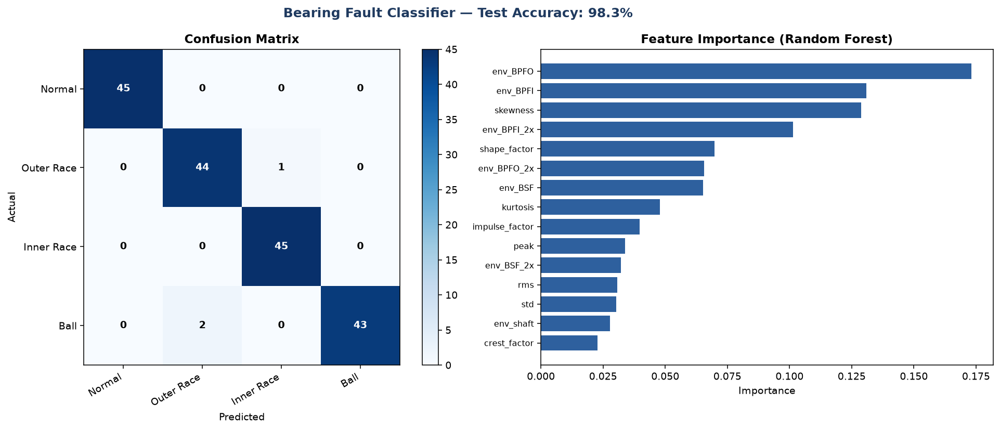
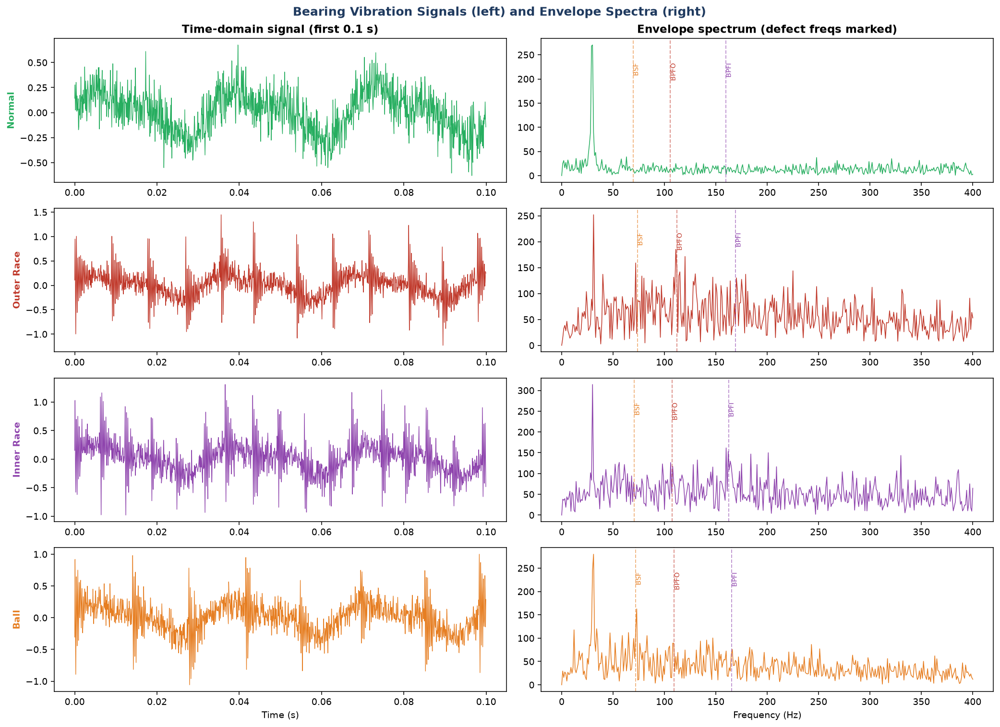

# Bearing Fault Detection from Vibration Signals

A machine-learning pipeline that diagnoses rolling-element bearing health from vibration
data — the core technique behind industrial **predictive maintenance** and condition
monitoring of rotating machinery.

> **Runnable demo:** [`bearing_fault_detection_demo.py`](bearing_fault_detection_demo.py)
> — runs out of the box, no data download needed.

**Result: 98.3% test accuracy** classifying four bearing conditions, with the model
relying on the physically-correct diagnostic features.



---

## Table of contents
1. [Why this matters](#why-this-matters)
2. [The physics: how a bearing fault shows up in vibration](#the-physics)
3. [Characteristic defect frequencies](#characteristic-defect-frequencies)
4. [The four conditions classified](#the-four-conditions)
5. [Pipeline overview](#pipeline-overview)
6. [Feature engineering explained](#feature-engineering-explained)
7. [Results & interpretation](#results--interpretation)
8. [How to run](#how-to-run)
9. [Using the real CWRU dataset](#using-the-real-cwru-dataset)
10. [Limitations & honesty notes](#limitations--honesty-notes)

---

## Why this matters

Rolling-element bearings are in nearly every rotating machine — motors, pumps,
gearboxes, turbines, compressors. Bearing failure is one of the most common causes of
unplanned machine downtime. **Vibration-based condition monitoring** lets you detect a
developing fault weeks or months before catastrophic failure, so maintenance can be
scheduled instead of forced.

The engineering value: a model that listens to a bearing's vibration and reports
*"healthy"*, *"outer-race defect"*, *"inner-race defect"*, or *"ball defect"* — and does
so reliably — directly reduces downtime and maintenance cost.

This project ties machine learning to the underlying **rotating-machinery dynamics** —
the same vibration/modal domain I work in for FEA.

---

## The physics

A localised defect on a bearing surface (a spall, crack, or pit) creates a tiny step.
Every time a rolling element rolls over that step, it produces a sharp mechanical
**impact**. Each impact "rings" the bearing housing's high-frequency structural
resonance, producing a short, decaying oscillation — like tapping a bell.

The key insight: **these impacts repeat at a precise, predictable rate** determined by
the bearing geometry and shaft speed. And that rate is *different* depending on *where*
the defect is:

- Defect on the **outer race** → impacts at the **Ball Pass Frequency, Outer race (BPFO)**
- Defect on the **inner race** → impacts at the **Ball Pass Frequency, Inner race (BPFI)**
- Defect on a **rolling element** → impacts at the **Ball Spin Frequency (BSF)**

So if we can measure *the rate at which impacts occur*, we can identify *which part of
the bearing is damaged*. That is the entire diagnostic principle.

There's a further subtlety the demo models faithfully:
- An **inner-race** defect rotates with the shaft, passing in and out of the load zone
  once per revolution → its impacts are **amplitude-modulated at shaft speed**.
- A **ball** defect's impacts are modulated at the **cage frequency (FTF)**.
- An **outer-race** defect is stationary in the load zone → **constant-amplitude** impacts.

These modulation signatures are additional clues the classifier can exploit.

---

## Characteristic defect frequencies

These come from standard bearing kinematics. For a bearing with `n` balls of diameter
`d`, pitch diameter `D`, contact angle `φ`, and shaft rotation frequency `fr`:

```
BPFO = (n/2) · fr · (1 − (d/D)·cos φ)        ← outer race
BPFI = (n/2) · fr · (1 + (d/D)·cos φ)        ← inner race
BSF  = (D/2d) · fr · (1 − ((d/D)·cos φ)²)     ← ball spin
FTF  = (fr/2) · (1 − (d/D)·cos φ)            ← cage / fundamental train
```

The demo uses geometry close to an **SKF 6205** bearing (the one used in the CWRU
benchmark dataset). Example output at 30 Hz (1800 rpm) shaft speed:

| Frequency | Value |
|-----------|-------|
| BPFO | 107.5 Hz |
| BPFI | 162.5 Hz |
| BSF  |  70.7 Hz |
| FTF  |  12.0 Hz |

---

## The four conditions

The demo generates physically-grounded synthetic signals for:

| Condition | Signature |
|-----------|-----------|
| **Normal** | Shaft harmonics + noise, no impact train |
| **Outer Race** | Constant-amplitude impacts at BPFO |
| **Inner Race** | Impacts at BPFI, amplitude-modulated at shaft speed |
| **Ball** | Impacts at BSF, modulated at cage frequency (FTF) |

Each signal adds randomised shaft speed (28–32 Hz), noise level, fault amplitude, and
timing jitter (bearing slip), so no two samples are identical — the classifier must
learn the *signature*, not memorise.

The left column below shows the raw time signals; you can see the periodic impact bursts
in the fault cases. The right column shows the **envelope spectra** with the
characteristic defect frequencies marked.



---

## Pipeline overview

```
 Vibration signal
       │
       ▼
 ┌─────────────────────┐
 │ Feature extraction  │   time-domain stats  +  envelope-spectrum energies
 └─────────────────────┘
       │
       ▼
 ┌─────────────────────┐
 │  Random Forest      │   trained on 70%, tested on 30% (stratified)
 │   classifier        │
 └─────────────────────┘
       │
       ▼
  Predicted condition  +  confusion matrix  +  feature importance
```

---

## Feature engineering explained

The model uses **15 features** in two families:

### Time-domain statistical features
These capture how "spiky" the signal is — impacts make the signal impulsive.

| Feature | What it measures | Why it helps |
|---------|------------------|--------------|
| RMS | Overall energy | Faults raise vibration energy |
| Peak | Largest excursion | Impacts create large peaks |
| **Kurtosis** | "Tailedness"/spikiness | Classic impulsiveness indicator — rises sharply with impacts |
| Skewness | Asymmetry | Impact direction asymmetry |
| **Crest factor** | Peak / RMS | High for impulsive (faulty) signals, low for smooth (healthy) |
| Impulse factor | Peak / mean-abs | Another impulsiveness ratio |
| Shape factor | RMS / mean-abs | Waveform shape |
| Std | Spread | Energy proxy |

### Envelope-spectrum features (the diagnostic core)
**Envelope analysis** is the gold-standard bearing technique. The Hilbert transform
extracts the signal's *envelope* (the slow amplitude modulation caused by the impact
rate), and its FFT reveals peaks at the defect frequencies. We measure the normalised
energy in narrow bands around each characteristic frequency:

- `env_BPFO`, `env_BPFO_2x` — energy at outer-race frequency and its 2nd harmonic
- `env_BPFI`, `env_BPFI_2x` — inner-race frequency and harmonic
- `env_BSF`, `env_BSF_2x` — ball-spin frequency and harmonic
- `env_shaft` — energy at shaft speed (modulation indicator)

These features directly encode "how strong is the impact pattern at each candidate
defect location?" — which is exactly how a human vibration analyst diagnoses bearings.

---

## Results & interpretation

**Test accuracy: 98.3%** on 180 held-out samples (45 per class).

```
              precision    recall  f1-score   support
        Ball      1.000     0.956     0.977        45
  Inner Race      0.978     1.000     0.989        45
      Normal      1.000     1.000     1.000        45
  Outer Race      0.957     0.978     0.967        45
    accuracy                          0.983       180
```

The most important point is **why** it works (see the feature-importance chart above):
the top features the model relies on are `env_BPFO`, `env_BPFI`, `env_BPFI_2x`, and
`env_BSF` — **the envelope energies at the characteristic defect frequencies.**

This is the validation that matters: the classifier didn't find a shortcut or artifact —
it learned the same physically-correct diagnostic signatures a domain expert would use.
That is the difference between a model that generalises and one that got lucky.

---

## How to run

```bash
pip install numpy scipy scikit-learn matplotlib
python bearing_fault_detection_demo.py
```

Outputs:
- Console: defect frequencies, dataset size, full classification report
- `signals_and_envelopes.png` — the signals and their envelope spectra
- `classification_results.png` — confusion matrix + feature importance

Runtime: ~30–60 s on a laptop CPU.

---

## Using the real CWRU dataset

The synthetic generator lets the demo run anywhere with zero setup, but the **exact same
feature-extraction and classification pipeline works on real data**. To use the
canonical [Case Western Reserve University Bearing Dataset](https://engineering.case.edu/bearingdatacenter):

1. Download the `.mat` files (Normal, Inner Race, Outer Race, Ball — at various fault
   diameters and loads).
2. Load them with `scipy.io.loadmat` and extract the drive-end accelerometer channel
   (key like `X097_DE_time`).
3. Segment each long recording into ~1 s windows to create many samples.
4. Replace the `generate_signal()` call in `build_dataset()` with your loaded windows;
   keep `extract_features()` and the classifier unchanged.

The CWRU bearing geometry (SKF 6205) and 12 kHz sampling rate are already used here, so
the defect-frequency formulas carry over directly.

---

## Limitations & honesty notes

- **The demo data is synthetic** — physically-grounded (real defect-frequency kinematics,
  resonance ringing, load-zone modulation, slip jitter, noise), but it is a model, not
  measured data. Real signals add gear mesh, structural paths, sensor effects, and
  variable load that make the problem harder. The 98% here would typically be somewhat
  lower on raw real data without careful preprocessing.
- **Fault severity is not classified** — only fault *location* (which surface). Estimating
  defect *size* (incipient vs. severe) is a harder regression problem.
- **Single operating regime** — narrow shaft-speed band. Real deployments must handle
  wide speed/load variation, which usually needs order-tracking or speed-normalised
  features.

These are deliberately stated: the project demonstrates the methodology and domain
understanding correctly, and is honest about the gap between a clean demo and production
condition monitoring.

**Stack:** Python · SciPy (Hilbert envelope, signal stats) · scikit-learn (Random Forest) · NumPy · Matplotlib
