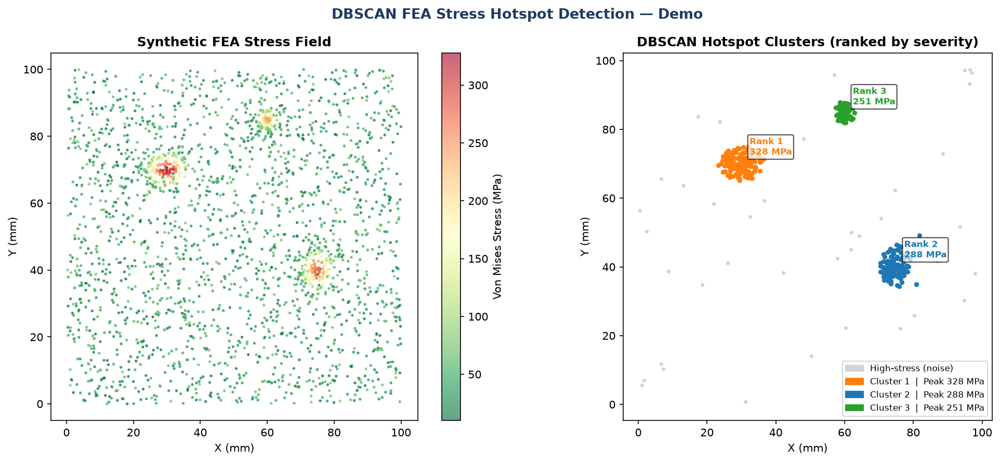

# DBSCAN Stress-Hotspot Detection for FEA Results

An unsupervised machine-learning tool that automatically finds and ranks structural
stress hotspots in finite-element results — replacing slow manual review of large
result databases.

> **Runnable demo:** [`dbscan_fea_clustering_demo.py`](dbscan_fea_clustering_demo.py)



---

## The problem

A modern FEA model can have millions of nodes. After a solve, an engineer must scan
the stress field to find the *critical regions* — peak-stress clusters around notches,
holes, weld toes, and fillets. Done by hand, this is slow, subjective, and easy to get
wrong when several hotspots compete for attention.

This tool automates that triage step.

---

## How it works

1. **Threshold filtering** — keep only nodes above a high stress percentile (here p85).
   This discards low-stress background and focuses the algorithm on critical material.
2. **Spatial scaling** — coordinates are standardised so the distance-based clustering
   treats each axis equally.
3. **DBSCAN clustering** — density-based clustering groups spatially-dense high-stress
   nodes into discrete hotspots. Unlike k-means, DBSCAN does **not** need the number of
   clusters specified in advance and naturally labels isolated outliers as noise — ideal
   when you don't know how many hotspots exist.
4. **Ranking** — clusters are ranked by peak and mean stress, so the engineer sees the
   most severe region first.
5. **Reporting** — a structured report lists each hotspot's node count, peak/mean stress,
   and centroid location.

---

## Why DBSCAN (and not k-means)?

| | k-means | **DBSCAN** |
|---|---|---|
| Need to pre-specify cluster count? | Yes | **No** |
| Handles arbitrary cluster shapes? | No (spherical) | **Yes** |
| Labels outliers/noise? | No | **Yes** |
| Fits "unknown number of hotspots"? | Poorly | **Perfectly** |

A stress field has an unknown number of hotspots with irregular shapes — exactly what
DBSCAN is built for.

---

## Demo output

The demo generates a synthetic stress field (a plate-like domain with three embedded
stress concentrations plus background noise), runs the detection pipeline, and produces:

- A console report ranking the detected hotspots
- A two-panel figure: the raw stress field, and the DBSCAN-detected clusters colour-coded
  and annotated with peak stress and rank

```
============================================================
  STRESS HOTSPOT REPORT
============================================================
  Rank   Nodes    Peak (MPa)     Mean (MPa)     Location (x, y)
------------------------------------------------------------
  1      143      328.0          192.2          (29.8, 70.1)
  2      113      287.8          180.9          (74.8, 40.2)
  3      68       251.4          160.4          (59.9, 84.8)
============================================================
```

---

## Production context

This demo reproduces the **methodology** of a tool built at BSH Hausgeräte GmbH (Bosch
Group), where nodal stress data is read from Ansys result databases via PyAnsys. The
production tool replaced a ~2-hour manual post-processing review with a ~5-minute
automated pipeline and was adopted across the global modelling team.

*No proprietary data is included here — the demo uses a synthetic stress field.*

---

## Run it

```bash
pip install numpy scikit-learn matplotlib
python dbscan_fea_clustering_demo.py
# -> console report + dbscan_hotspot_result.png
```

**Stack:** Python · scikit-learn (DBSCAN) · NumPy · Matplotlib
