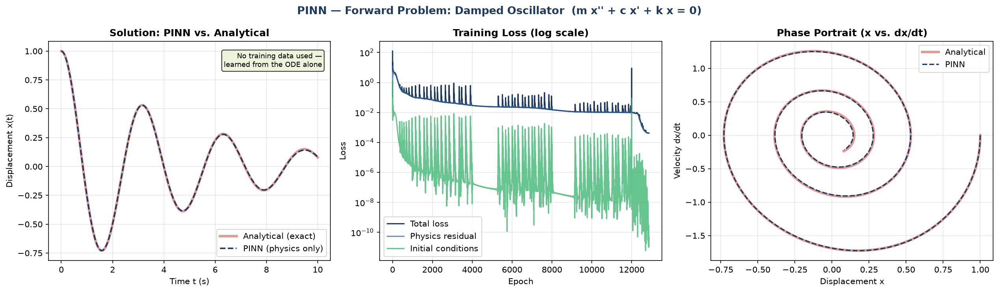
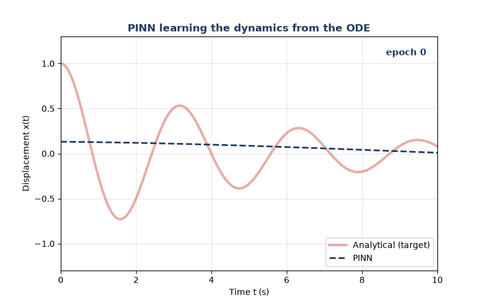
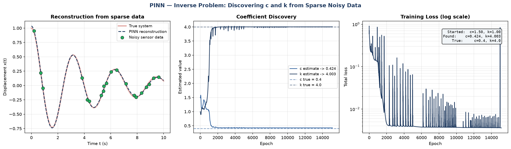

# Physics-Informed Neural Networks (PINNs)

Neural networks that learn to obey the laws of physics — the governing differential
equation is built directly into the loss function via automatic differentiation.
No mesh, and (for the forward problem) no training data.

> **Runnable demo:** [`pinn_damped_oscillator_demo.py`](pinn_damped_oscillator_demo.py)

---

## The problem

The canonical structural-dynamics equation — free vibration of a damped oscillator:

```
m·x''(t) + c·x'(t) + k·x(t) = 0
```

where `m` = mass, `c` = damping, `k` = stiffness. This is the 1-DOF building block
behind modal analysis, NVH, and rotordynamics.

A PINN represents the solution `x(t)` as a small neural network. Instead of training
on labelled `(t, x)` pairs, it is trained so that its own derivatives — computed by
autograd — satisfy the ODE at a set of collocation points.

---

## Two experiments

### 1. Forward problem — solve the ODE from physics alone

Coefficients are known. The network is trained on the physics residual plus the
initial conditions `x(0)=1, x'(0)=0` — **with no data whatsoever**. It recovers the
full motion to **0.9% relative error** against the exact analytical solution.



*Left: PINN vs. analytical. Centre: loss history — Adam for global search, then an
LBFGS polish phase that drops the error by two orders of magnitude. Right: phase
portrait (displacement vs. velocity) spiralling to the origin as the system damps out.*



*The network learning the dynamics over training.*

### 2. Inverse problem — discover the physics from sparse, noisy data

This is the powerful one. The damping `c` and stiffness `k` are **unknown**. We are
given only **20 noisy "sensor" measurements** (2% noise) and the *structure* of the
equation. The PINN simultaneously reconstructs the full motion **and discovers the
hidden coefficients** — starting from deliberately wrong initial guesses:

| Coefficient | Initial guess | Discovered | True | Error |
|-------------|---------------|------------|------|-------|
| Stiffness `k` | 1.0 | **4.003** | 4.0 | 0.08% |
| Damping `c`   | 1.5 | **0.424** | 0.4 | 5.9%  |



*Left: the PINN reconstructs the true motion from a handful of scattered noisy points.
Centre: the unknown coefficients converge from wrong guesses to their hidden true
values during training. Right: the loss curve.*

> Note: stiffness `k` is recovered almost exactly, while damping `c` carries more
> error — this is physically expected. In a lightly-damped system (ζ ≈ 0.1) the
> damping is a small, second-order effect that is genuinely harder to identify from
> noisy data. This is the same challenge faced in experimental modal analysis.

---

## Why this matters / how it connects to engineering

The inverse problem **is system identification / model correlation** — exactly what
an FEA engineer does when tuning a simulation's material or damping parameters to
match physical test data. PINNs make it native to machine learning:

- **Data assimilation**: fuse sparse sensor data with known physics
- **Parameter discovery**: extract material/system properties from measurements
- **Mesh-free**: the solution is a continuous function, evaluable anywhere
- **High dimensions**: no meshing means PINNs scale to problems where FEM's curse
  of dimensionality bites

PINNs are not a replacement for FEM on stiff, discontinuous, or large-scale problems —
they shine on inverse problems, data fusion, and smooth high-dimensional PDEs.

---

## Key technical points demonstrated

- Automatic differentiation to compute `x'`, `x''` of a network w.r.t. its input
- Composite loss: physics residual + initial conditions (forward) / + data (inverse)
- Learnable physical parameters (`c`, `k` as `nn.Parameter`, log-parameterised to stay positive)
- Two-stage optimisation: **Adam** (global search) → **LBFGS** (second-order polish) —
  the standard recipe for combating PINN spectral bias on oscillatory solutions
- Input normalisation and IC loss weighting for stable convergence

**Stack:** PyTorch · NumPy · Matplotlib

```bash
python pinn_damped_oscillator_demo.py
# -> pinn_forward_result.png, pinn_inverse_result.png, pinn_training_evolution.gif
```
