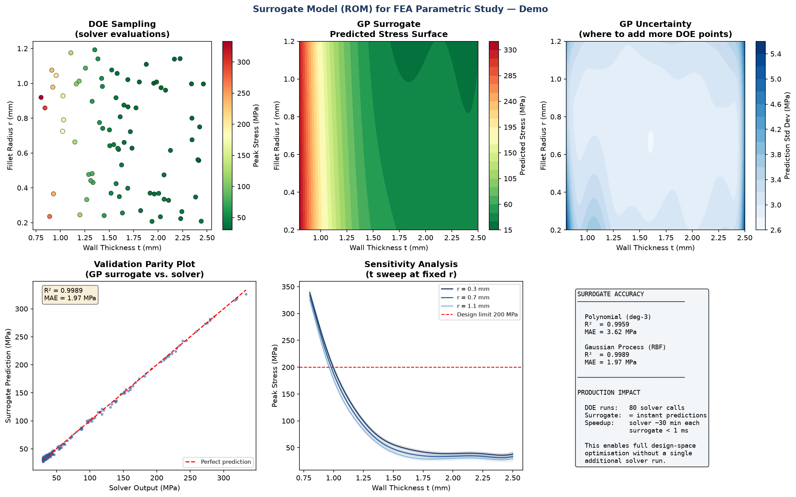

# Surrogate Models (ROMs) for FEA Parametric Studies

A machine-learning surrogate that replaces an expensive FEA solver for design
exploration — turning hours of solver runs into millisecond predictions.

> **Runnable demo:** [`surrogate_model_demo.py`](surrogate_model_demo.py)



---

## The problem

Design optimisation and sensitivity studies need *many* simulation evaluations — often
hundreds or thousands across a parameter space. If each nonlinear FEA run takes 20–40
minutes, sweeping a design space directly is infeasible.

A **surrogate model** (also called a Reduced-Order Model, ROM, or response surface)
solves this: run the real solver at a limited set of sample points, then train an ML
model to approximate the solver's input→output mapping. The surrogate then predicts new
designs instantly.

---

## How it works

1. **DOE sampling** — sample the design space (here: wall thickness `t` and fillet radius
   `r`) and evaluate the response (peak stress) at each point. In production this is the
   Ansys Optislang DOE running the FEA solver; in the demo a synthetic nonlinear function
   stands in for the solver.
2. **Train two surrogates:**
   - **Polynomial response surface** (degree-3 ridge regression) — fast, interpretable
   - **Gaussian Process (RBF kernel)** — captures complex nonlinearity *and* returns a
     prediction-uncertainty estimate
3. **Validate** against unseen solver evaluations (parity plot, R², MAE)
4. **Exploit** — sweep the full design space at near-zero cost: response surfaces,
   uncertainty maps, sensitivity curves, and optimisation.

---

## Why the Gaussian Process is powerful here

The GP doesn't just predict a value — it predicts a **confidence interval**. That tells
you *where the surrogate is unsure*, which is exactly where you should run more solver
evaluations next (active learning / adaptive sampling). The demo visualises this
uncertainty map.

---

## Demo output

A six-panel figure:

| Panel | Shows |
|-------|-------|
| DOE sampling | The solver evaluations used for training |
| GP predicted surface | The full response surface from the surrogate |
| GP uncertainty | Where the surrogate is least confident |
| Validation parity | Predicted vs. actual on unseen points (R² ≈ 0.999) |
| Sensitivity sweep | Stress vs. thickness at fixed radii, with a design limit line |
| Summary | Accuracy metrics + the solver-vs-surrogate speed-up |

Typical accuracy on held-out data: **R² ≈ 0.999, MAE ≈ 2 MPa** — from only ~80 solver
samples.

---

## Production context

This reproduces the **methodology** of surrogate-model (ROM) pipelines built at BSH
Hausgeräte GmbH (Bosch Group) using Ansys Optislang for highly nonlinear parametric
studies — enabling rapid design optimisation without repeated solver runs.

*No proprietary data is included — the demo uses a synthetic response function.*

---

## Run it

```bash
pip install numpy scikit-learn matplotlib
python surrogate_model_demo.py
# -> console metrics + surrogate_model_result.png
```

**Stack:** Python · scikit-learn (Gaussian Process, polynomial regression) · NumPy · Matplotlib
